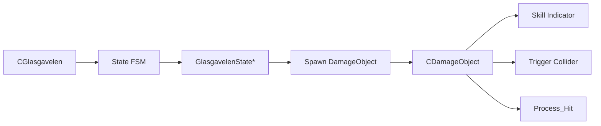

## Overview
Glasgavelen 보스는 공격 패턴 수가 많고, 각 패턴마다  
선딜, 판정 지속시간, 범위, 히트 처리, 카메라/이펙트 연출이 함께 따라붙는 구조였습니다.

이때 모든 로직을 상태 클래스 안에 넣으면  
상태 객체가 “행동 결정”과 “공격 판정”을 동시에 떠안게 되어 빠르게 비대해질 수 있다고 판단했습니다.

그래서 이 보스는  
- `State` 객체가 **언제 어떤 행동을 할지 결정**하고
- `DamageObject`가 **실제 공격 판정과 지속시간, 히트 처리**를 담당하는 방식으로  
책임을 분리해 설계했습니다.

---

## Core Design
- `CGlasgavelen`
  - FSM 상태 전환과 보스 공통 데이터 관리

- `GlasgavelenState*`
  - 패턴 진입 조건과 행동 흐름 제어
  - 어떤 공격을 언제 실행할지 결정

- `CDamageObject`
  - 공격 판정 오브젝트
  - 준비 시간, 유효 시간, 충돌 범위, 히트 처리 담당

- `CGlasgavelenDefaultAttack`, `CGlasgavelenShockwave`
  - 개별 공격 패턴을 독립된 판정 오브젝트로 구현



### 1. Boss Controller Structure
CGlasgavelen은 보스의 공통 상태, FSM 상태 배열, 페이즈 및 전투 관련 플래그를 보유하는 컨트롤러 역할을 담당합니다.
```cpp
class CGlasgavelen : public CMonsterBase
{
public:
    enum GlasgavelenState
    {
        Glasgavelen_ENTER,
        Glasgavelen_IDLE,
        Glasgavelen_CUTSCENE,
        Glasgavelen_BREAK,
        Glasgavelen_MOVE,
        Glasgavelen_DEFAULT_ATTACK,
        Glasgavelen_BACKJUMP,
        Glasgavelen_SKILL_STOM,
        Glasgavelen_SKILL_SPINSLASH,
        Glasgavelen_SKILL_CHARGERUN,
        Glasgavelen_SKILL_LEAPATTACK,
        Glasgavelen_SKILL_FLAMEERUPTION,
        Glasgavelen_SKILL_FLAMEEBREATH,
        Glasgavelen_SKILL_RUTHLESSBLADE,
        Glasgavelen_SKILL_SHOCKWAVE,
        Glasgavelen_SKILL_LASERBEAM,
        Glasgavelen_SKILL_SUMMONGAGOYLE,
        Glasgavelen_SKILL_DOOMBRAND,
        Glasgavelen_SKILL_EARTHSLICE,
        Glasgavelen_DEAD,
        Glasgavelen_END
    };

private:
    GlasgavelenState        m_CurrentState = {};
    shared_ptr<CState>      m_States[Glasgavelen_END] = {};

    _bool m_bActiveBreak = { false };
    _bool m_bLaserTiming = { false };
    _int  m_iPhase = { 0 };
};
```
> 이 구조를 통해 보스 본체는  
> 상태 전환의 허브 역할과 보스 공통 데이터 관리에 집중하고,
> 개별 패턴 실행은 각각의 상태 객체로 분리할 수 있도록 했습니다.

---
### 2. FSM Update and State Change
매 프레임 보스는 FSM을 통해 현재 상태를 갱신하며,  
상태 변경 시 Combat 상태도 함께 동기화합니다.
```cpp
void Client::CGlasgavelen::Priority_Update(_float fTimeDelta)
{
    m_pFSM->FSM_Priority_Update(fTimeDelta);
    CMonsterBase::Priority_Update(fTimeDelta);
}

void Client::CGlasgavelen::Update(_float fTimeDelta)
{
    m_pFSM->FSM_Update(fTimeDelta);
    m_pModelCom->Play_Animation(fTimeDelta);
    CMonsterBase::Update(fTimeDelta);
}

void CGlasgavelen::Change_State(_int state, _bool restart)
{
    if (state < 0 || state >= Glasgavelen_END)
        return;

    m_CurrentState = static_cast<GlasgavelenState>(state);
    m_pFSM->Change_State(m_States[m_CurrentState], restart);

    switch (m_CurrentState)
    {
        case Glasgavelen_DEFAULT_ATTACK:
            m_pCombatCom->Set_CombatState(COMBAT_ATTACK);
            break;
        case Glasgavelen_CUTSCENE:
        case Glasgavelen_DEAD:
            m_pCombatCom->Set_CombatState(COMBAT_UNABLECOMBAT);
            break;
        default:
            m_pCombatCom->Set_CombatState(COMBAT_PEACE);
            break;
    }
}
```
> 상태 전환이 전투 가능 상태(공격 / 평시 / 불가) 도 함께 맞춰지도록 하여    
> AI 흐름과 전투 시스템 상태를 동시에 조율하는 허브 역할을 합니다.

--- 

### 3. Damage / Break / Special Transition Handling
보스의 피격 처리에서는 단순 체력 감소뿐 아니라  
브레이크 게이지, 브레이크 상태 진입, 사망 상태 전환까지 함께 처리합니다.
```cpp
void Client::CGlasgavelen::Take_Damage(DamageInfo& info)
{
    const _int damage = info.iDamage + static_cast<_int>(m_pGameInstance->Compute_Random(-20.f,20.f));

    Set_Blink(COLOR::COLOR_RED);

    if (m_bActiveBreak)
    {
        weak_ptr<CBreakGauge> breakGauge = CUI_Manager::GetInstance()->Get_BreakUI();

        m_Monster_Status->iBrakeGauge += info.iBrakePower;

        float value = 0.f;
        if (m_Monster_Status->iMaxBrakeGauge > 0)
        {
            value = static_cast<float>(m_Monster_Status->iBrakeGauge) / static_cast<float>(m_Monster_Status->iMaxBrakeGauge);
            value = std::clamp(value, 0.f, 1.f);
        }

        breakGauge.lock()->SetBreakRatio(value);

        {
            m_Monster_Status->iBrakeGauge = 0;
            m_Monster_Status->bActiveBrake = true;
            m_Monster_Status->bBraking = true;
            info.bIsBreak = true;

            m_bActiveBreak = false;
        }

        info.bIsVulnerable = m_Monster_Status->bBraking;
    }

    CUI_Manager::GetInstance()->DamageBossHpUI(damage * 20);

    if (m_Monster_Status->iHp <= 0)
        Change_State(Glasgavelen_DEAD);
    else if (m_Monster_Status->bActiveBrake)
    {
        m_Monster_Status->bActiveBrake = false;

        if (m_CurrentState != Glasgavelen_BREAK)
            Change_State(Glasgavelen_BREAK);
    }

    m_HitFrame = true;
}
```

---

### 4. Attack Object Separation
공격은 상태 클래스 내부에 판정 로직을 직접 넣지 않고
CDamageObject 파생 오브젝트로 분리했습니다.
```cpp
void CGlasgavelenShockwave::OnHit(shared_ptr<CGameObject> pTarget)
{
    if (pTarget->Get_GameObjectTag() != TEXT("GameObject_Player"))
        return;

    auto pTrigger = std::dynamic_pointer_cast<CTriggerCollider>(m_pHitColliderCom);
    if (!pTrigger)
        return;

    _vector vHitPos = pTarget->Get_Transform()->Get_State(CTransform::STATE_POSITION);
    DamageInfo damageInfo(m_pOwner.lock(), m_iDamage, 0, vHitPos, true);
    m_pGameInstance->Process_Hit(m_pHitColliderCom, pTarget, damageInfo);
}
```
> 보스 상태 클래스는 “언제 공격을 생성할지”에 집중하고,  
> 공격 오브젝트는 “어떻게 맞출지”를 담당하게 되어 책임을 분리 했습니다.
