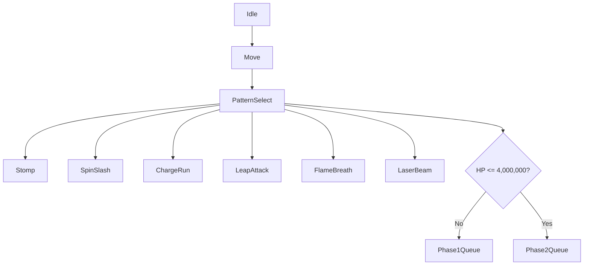

## Overview
Glasgavelen은 다수의 공격 패턴과 페이즈 전환을 가지는 보스였기 때문에,  
단일 클래스 내부의 거대한 분기문보다 **상태 객체 기반 FSM**과  
**패턴 큐 기반 전투 흐름 제어**를 중심으로 구조화했습니다.

각 상태는 Idle, Move, Stomp, SpinSlash, ChargeRun, LeapAttack, FlameBreath 등  
개별 행동 단위로 분리되어 있으며,  
보스의 HP가 특정 기준 이하로 내려가면 Phase2 패턴 큐로 전환되도록 설계했습니다.


## Core Design
- `CGlasgavelen`
  - 보스의 전반적인 상태 관리
  - 현재 HP에 따른 페이즈 전환
  - 패턴 큐 관리

- `GlasgavelenState`
  - 개별 공격/행동 상태 구현
  - 상태별 진입, 갱신, 종료 처리

- `Pattern Queue`
  - 등록된 패턴을 순환하며 선택
  - HP 조건에 따라 Phase1 / Phase2 큐 교체
 


```md
### 1. Boss Controller Structure
> `CGlasgavelen`은 현재 상태, 패턴 큐, 페이즈 전환 조건을 관리하는 보스 컨트롤러 역할을 담당합니다.

```cpp
class CGlasgavelen : public CMonster
{
private:
    shared_ptr<CGlasgavelenState> m_pCurState;
    queue<STATE_TYPE> m_Phase1PatternQueue;
    queue<STATE_TYPE> m_Phase2PatternQueue;
    bool m_bPhase2 = false;

public:
    void Update_State(float fTimeDelta);
    void Change_State(STATE_TYPE eState);
    void Update_Phase();
};
```
