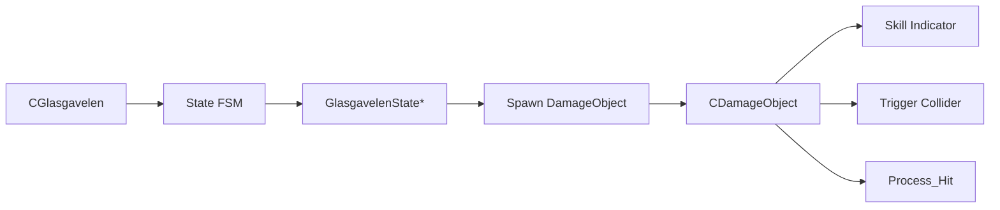

## 개요
Glasgavelen 보스는 공격 패턴 수가 많고, 각 패턴마다  
선딜, 판정 지속시간, 범위, 히트 처리, 카메라/이펙트 연출이 함께 따라붙는 구조였습니다.

이때 모든 로직을 상태 클래스 안에 넣으면  
상태 객체가 “행동 결정”과 “공격 판정”을 동시에 떠안게 되어 빠르게 비대해질 수 있다고 판단했습니다.

그래서 이 보스는  
- `State` 객체가 **언제 어떤 행동을 할지 결정**하고
- `DamageObject`가 **실제 공격 판정과 지속시간, 히트 처리**를 담당하는 방식으로  
책임을 분리해 설계했습니다.

---

### 공격 오브젝트 공통 구조
[🔗 DamageObject.h](../Scripts/Glasgavelen%20Boss%20AI/DamageObject.h)  
[🔗 DamageObject.cpp](../Scripts/Glasgavelen%20Boss%20AI/DamageObject.cpp)

### 상태 객체에서 공격 실행
[🔗 GlasgavelenStateAttack.h](../Scripts/Glasgavelen%20Boss%20AIt/GlasgavelenStateAttack.h)  
[🔗 GlasgavelenStateIAttack.cpp](../Scripts/Glasgavelen%20Boss%20AI/GlasgavelenStateIAttack.cpp)

### 공격 오브젝트 예시
[🔗 GlasgavelenDefaultAttack.h](../Scripts/Glasgavelen%20Boss%20AI/GlasgavelenDefaultAttack.h)  
[🔗 GlasgavelenDefaultAttack.cpp](../Scripts/Glasgavelen%20Boss%20AI/GlasgavelenDefaultAttack.cpp)

---

## 핵심 구조
- `CGlasgavelen`
  - FSM 상태 전환과 보스 공통 데이터 관리

- `GlasgavelenState`
  - 패턴 진입 조건과 행동 흐름 제어
  - 어떤 공격을 언제 실행할지 결정

- `CDamageObject`
  - 공격 판정 오브젝트
  - 준비 시간, 유효 시간, 충돌 범위, 히트 처리 담당

- `CGlasgavelenDefaultAttack`, `CGlasgavelenShockwave`
  - 개별 공격 패턴을 독립된 판정 오브젝트로 구현



### 1. State Object: 행동 결정
CGlasgavelen은 현재 상태와 FSM 전환을 관리하고,  
개별 상태 객체는 보스가 다음에 어떤 행동을 할지 결정합니다.
```cpp
class CGlasgavelen : public CMonsterBase
{
private:
    GlasgavelenState        m_CurrentState = {};
    shared_ptr<CState>      m_States[Glasgavelen_END] = {};
};
```
```cpp
void CGlasgavelen::Change_State(_int state, _bool restart)
{
    if (state < 0 || state >= Glasgavelen_END)
        return;

    m_CurrentState = static_cast<GlasgavelenState>(state);
    m_pFSM->Change_State(m_States[m_CurrentState], restart);
}
```

---

### 2. DamageObject: 공격 판정 분리
공격은 상태 클래스 안에서 직접 충돌 판정을 수행하지 않고,  
CDamageObject 파생 객체로 분리했습니다.
```cpp
class CDamageObject : public CGameObject
{
protected:
    shared_ptr<CTriggerCollider> m_pHitColliderCom = { nullptr };

    weak_ptr<CGameObject> m_pOwner;
    string m_strSkillName = {};

    _float m_fReadyTimer = {};
    _float m_fReadyDuration = {};
    _bool  m_IsSkillActive = { false };

public:
    virtual void Active_Skill() = 0;
};
```
```cpp
void Client::CDamageObject::Update(_float fTimeDelta)
{
    m_fReadyTimer += fTimeDelta;

    if (m_IsSkillActive == false && m_fReadyTimer >= m_fReadyDuration)
    {
        Active_Skill();
        m_IsSkillActive = true;
    }
}
```
> 이 구조를 통해 DamageObject는
> - 공격 준비 시간
> - 활성화 시점
> - 충돌 범위
> - 히트 처리

> 를 독립적으로 관리할 수 있습니다.

--- 

### 3. Example: DefaultAttack
CGlasgavelenDefaultAttack은 전방 직사각형 범위 공격을 담당하는 DamageObject입니다.  
상태 객체가 이 오브젝트를 생성하면, DamageObject가 스스로 준비 → 활성화 → 히트 처리를 수행합니다.  
### 3-1. Spawn: 공격 예고 생성
```cpp
void CGlasgavelenDefaultAttack::Spawn(_fvector spawnPos)
{
    m_pTransformCom->Set_State(CTransform::STATE_POSITION, spawnPos);
    m_pIndicatorManager->Request(
        CSkillIndicator::SHAPE_RECTANGLE_FORWARD,
        { 5.f, m_Length },
        m_fReadyDuration,
        m_pOwner.lock()->Get_Transform()->Get_WorldMatrix_Ptr());

    m_fReadyTimer = 0;
    m_IsSkillActive = false;

    Set_Active(true);
}
```
> 이 단계에서는 실제 데미지를 주지 않고,  
> 공격 범위와 준비 시간을 플레이어에게 먼저 노출합니다.
### 3-2. Active_Skill: 실제 공격 활성화
```cpp
void Client::CGlasgavelenDefaultAttack::Active_Skill()
{
    auto pTrigger = dynamic_pointer_cast<CTriggerCollider>(m_pHitColliderCom);
    if (pTrigger)
    {
        AttackerInfo attackerInfo;
        attackerInfo.pTriggerCollider = pTrigger;
        attackerInfo.bIsAttacking = true;
        attackerInfo.fAttackDuration = 2.5f;

        m_pGameInstance->Start_Attack(attackerInfo);
    }

    static_pointer_cast<CPlayerCamera>(m_pGameInstance->Find_Camera("PLAYER_CAM"))
        ->Active_Vibration(1.0f, 3.0f, 3.0f, 0.0f);
}
```
> 준비 시간이 끝나면 TriggerCollider를 공격자로 등록하고,  
> 실제 판정과 카메라 연출을 시작합니다.
### 3-3. OnHit: 맞았을 때 처리
```cpp
void CGlasgavelenDefaultAttack::OnHit(shared_ptr<CGameObject> pTarget)
{
    if (pTarget->Get_GameObjectTag() != TEXT("GameObject_Player"))
        return;

    auto pTrigger = std::dynamic_pointer_cast<CTriggerCollider>(m_pHitColliderCom);
    if (!pTrigger)
        return;

    DamageInfo damageInfo(m_pOwner.lock(), static_cast<_int>(m_iDamage));
    m_pGameInstance->Process_Hit(m_pHitColliderCom, pTarget, damageInfo);
}
```
> 공격 판정은 상태 객체가 아니라 DamageObject가 직접 처리합니다.

---

## 책임을 분리한 이유
이 구조에서 얻고 싶었던 핵심은  
상태 객체가 공격 판정 디테일까지 떠안지 않게 하는 것 이었습니다.

상태 클래스가 공격 범위, 준비 시간, 트리거 등록, 히트 처리까지 모두 담당하면  
패턴 수가 늘어날수록 상태 클래스가 빠르게 비대해지고,  
비슷한 공격 로직이 여러 상태에 반복될 가능성이 커집니다.

---
## Design Notes
### 핵심
이 보스에서 가장 중요하게 본 부분은
행동 결정과 공격 판정을 분리하는 것 이었습니다.

### 장점
- 상태 객체가 비대해지는 것을 방지
- 공격 준비 시간과 판정 지속시간을 독립적으로 제어 가능
- 공격 범위 표시, 충돌 판정, 히트 처리를 재사용 가능한 단위로 분리
- 새로운 공격 패턴 추가 시 상태와 공격 오브젝트를 조합하는 방식으로 확장 가능

### 보완할 점
- 현재는 DamageObject 종류별로 개별 클래스가 늘어날 수 있으므로,  
장기적으로는 더 일반화된 Attack Descriptor 기반 구조로 확장 가능
- 공격 오브젝트 생성/회수는 풀링 구조와 결합하면 성능상 더 유리할 수 있음
