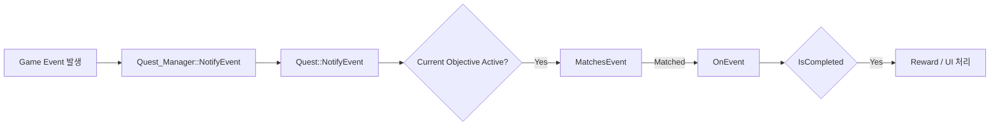

# Quest System

## Overview
이 시스템은 JSON 기반 퀘스트 데이터를 로드한 뒤,  
현재 활성화된 Objective에 대해서만 이벤트를 전달하고,  
각 Objective가 이벤트 필터링, 진행도 반영, 완료 판정을 나누어 처리하는 구조로 설계했습니다.

`CQuest_Manager`는 퀘스트 데이터 로드와 Objective 생성을 담당하고,  
`CQuest`는 현재 진행 중인 Objective 선택과 보상 처리를 맡으며,  
`CObjective` 파생 클래스는 퀘스트 타입별 조건 해석 로직을 담당합니다.

---

## Core Design
- `CQuest_Manager`
  - JSON 파일 재귀 로드
  - `strQuestType`에 따라 Objective 인스턴스 생성
  - 외부 시스템에 `Activate`, `NotifyEvent` 인터페이스 제공

- `CQuest`
  - Objective 목록 보관
  - 현재 활성 Objective 관리
  - 완료 시 상태 전환, UI 연출, 보상 지급 처리

- `CObjective`
  - `MatchesEvent` : 이 이벤트를 처리할지 판정
  - `OnEvent` : 진행도 반영
  - `IsCompleted` : 완료 조건 판정
  - `Activate`, `IsActivated` : 활성 상태 제어



## 1. Quest Manager: JSON Load & Objective Creation
> CQuest_Manager는 퀘스트 시스템의 진입점 역할을 하며,  
> 초기화 시 JSON 파일을 재귀적으로 읽고 Objective 인스턴스를 생성합니다.
```cpp
HRESULT CQuest_Manager::Initialize()
{
    m_pQuest = CQuest::Create();

    Load_Json(L"../Bin/DataFiles/Json/Quest");

    return S_OK;
}

HRESULT CQuest_Manager::Load_Json(const wstring& folderPath)
{
    for (const auto& entry : fs::recursive_directory_iterator(folderPath))
    {
        if (entry.is_regular_file())
            Load_SingleScript(entry.path().wstring());
    }

    return S_OK;
}
```
> 이 구조를 통해 퀘스트 데이터는 코드와 분리되어 관리되며,  
> 폴더 단위로 JSON을 추가하는 방식으로 콘텐츠를 확장할 수 있습니다.
---
2. Quest Manager: Objective Type Dispatch
> 로드된 JSON은 strQuestType 값에 따라 서로 다른 Objective 클래스로 생성됩니다.
```cpp
HRESULT CQuest_Manager::Load_SingleScript(const wstring& filePath)
{
    json j;
    if (FAILED(CJson_Manager::GetInstance()->Load_Json(filePath, j)))
        return E_FAIL;

    QUEST_DESC desc;
    desc.FromJson(j);

    CleanWString(desc.objective.strQuestType);

    if (desc.objective.strQuestType == L"TalkToNPC")
    {
        auto pTalkObjective = make_shared<CObjective_TalkToNPC>();
        pTalkObjective->Set_QuestDesc(desc);
        m_pQuest->Add_Objective(pTalkObjective);
    }
    else if (desc.objective.strQuestType == L"MonsterKill")
    {
        auto pKillObjective = make_shared<CObjective_MonsterKill>();
        pKillObjective->Set_QuestDesc(desc);
        m_pQuest->Add_Objective(pKillObjective);
    }
    else if (desc.objective.strQuestType == L"ItemUse")
    {
        auto pItemObjective = make_shared<CObjective_ItemUse>();
        pItemObjective->Set_QuestDesc(desc);
        m_pQuest->Add_Objective(pItemObjective);
    }
    return S_OK;
}
```
> 현재는 문자열 분기 방식으로 Objective를 생성하고 있으며,
> 새로운 퀘스트 타입을 추가할 때는 파생 Objective 클래스와 생성 분기만 추가하면 됩니다.
