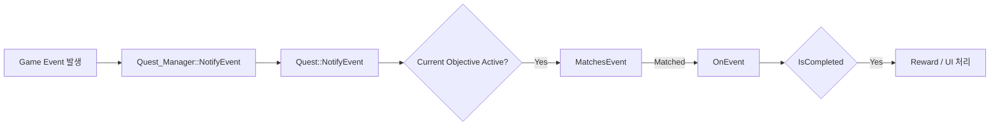

# Quest System

## Overview
이 시스템은 JSON 기반 퀘스트 데이터를 로드한 뒤,  
현재 활성화된 Objective에 대해서만 이벤트를 전달하고,  
각 Objective가 이벤트 필터링, 진행도 반영, 완료 판정을 나누어 처리하는 구조로 설계했습니다.

`CQuest_Manager`는 퀘스트 데이터 로드와 Objective 생성을 담당하고,  
`CQuest`는 현재 진행 중인 Objective 선택과 보상 처리를 맡으며,  
`CObjective` 파생 클래스는 퀘스트 타입별 조건 해석 로직을 담당합니다.

---

## Core Design
- `CQuest_Manager`
  - JSON 파일 재귀 로드
  - `strQuestType`에 따라 Objective 인스턴스 생성
  - 외부 시스템에 `Activate`, `NotifyEvent` 인터페이스 제공

- `CQuest`
  - Objective 목록 보관
  - 현재 활성 Objective 관리
  - 완료 시 상태 전환, UI 연출, 보상 지급 처리

- `CObjective`
  - `MatchesEvent` : 이 이벤트를 처리할지 판정
  - `OnEvent` : 진행도 반영
  - `IsCompleted` : 완료 조건 판정
  - `Activate`, `IsActivated` : 활성 상태 제어



### 1. Quest Manager: JSON Load & Objective Creation
CQuest_Manager는 퀘스트 시스템의 진입점 역할을 하며,  
초기화 시 JSON 파일을 재귀적으로 읽고 Objective 인스턴스를 생성합니다.
```cpp
HRESULT CQuest_Manager::Initialize()
{
    m_pQuest = CQuest::Create();

    Load_Json(L"../Bin/DataFiles/Json/Quest");

    return S_OK;
}

HRESULT CQuest_Manager::Load_Json(const wstring& folderPath)
{
    for (const auto& entry : fs::recursive_directory_iterator(folderPath))
    {
        if (entry.is_regular_file())
            Load_SingleScript(entry.path().wstring());
    }

    return S_OK;
}
```
> 이 구조를 통해 퀘스트 데이터는 코드와 분리되어 관리되며,  
> 폴더 단위로 JSON을 추가하는 방식으로 콘텐츠를 확장할 수 있습니다.

---

### 2. Quest Manager: Objective Type Dispatch
로드된 JSON은 strQuestType 값에 따라 서로 다른 Objective 클래스로 생성됩니다.
```cpp
HRESULT CQuest_Manager::Load_SingleScript(const wstring& filePath)
{
    json j;
    if (FAILED(CJson_Manager::GetInstance()->Load_Json(filePath, j)))
        return E_FAIL;

    QUEST_DESC desc;
    desc.FromJson(j);

    CleanWString(desc.objective.strQuestType);

    if (desc.objective.strQuestType == L"TalkToNPC")
    {
        auto pTalkObjective = make_shared<CObjective_TalkToNPC>();
        pTalkObjective->Set_QuestDesc(desc);
        m_pQuest->Add_Objective(pTalkObjective);
    }
    else if (desc.objective.strQuestType == L"MonsterKill")
    {
        auto pKillObjective = make_shared<CObjective_MonsterKill>();
        pKillObjective->Set_QuestDesc(desc);
        m_pQuest->Add_Objective(pKillObjective);
    }
    else if (desc.objective.strQuestType == L"ItemUse")
    {
        auto pItemObjective = make_shared<CObjective_ItemUse>();
        pItemObjective->Set_QuestDesc(desc);
        m_pQuest->Add_Objective(pItemObjective);
    }
    return S_OK;
}
```
> 현재는 문자열 분기 방식으로 Objective를 생성하고 있으며,  
> 새로운 퀘스트 타입을 추가할 때는 파생 Objective 클래스와 생성 분기만 추가하면 됩니다.

---

### 3. Quest: Event Dispatch to Current Objective
```cpp
void CQuest::NotifyEvent(const wstring& type, const wstring& value)
{
    if (m_pCurrentObjective == nullptr)
        return;

    if (m_pCurrentObjective->Get_CurrentState() == EQuestState::REWARD)
        return;

    if (!m_pCurrentObjective->IsActivated())
        return;

    if (!m_pCurrentObjective->MatchesEvent(type, value))
        return;

    if (m_pCurrentObjective->OnEvent(type, value) && m_pCurrentObjective->IsCompleted())
    {
        m_pCurrentObjective->Set_CurrentState(EQuestState::REWARD);
        ...
    }
}
```
> 이 흐름에서 중요한 점은 다음과 같습니다.
> - 현재 진행 중인 Objective가 아니면 처리하지 않음
> - Objective가 이벤트를 받을 수 있는 상태인지 먼저 확인  
> - 이벤트 타입이 일치할 때만 진행도 갱신  
> - 완료 시에만 후속 처리 실행  
> 즉, 이벤트 전달은 공통화하고, 이벤트 해석은 Objective에 위임하는 구조입니다.

---

### 4. Quest: Objective Activation
퀘스트 활성화 시점에는 questID에 해당하는 Objective를 찾아 현재 진행 상태로 전환합니다.
```cpp
shared_ptr<CObjective> CQuest::ActivateObjective(const wstring& questID)
{
    if (m_pCurrentObjective != nullptr &&
        m_pCurrentObjective->Get_CurrentState() == EQuestState::INPROGRESS)
    {
        return m_pCurrentObjective;
    }

    for (auto& obj : m_Objectives)
    {
        if (obj->Get_CurrentState() == EQuestState::REWARD)
            continue;

        wstring _questID = obj->Get_QuestDesc().strQuestID;
        Client::CleanWString(_questID);

        if (_questID == questID)
        {
            m_pCurrentObjective = obj;
            m_pCurrentObjective->Activate();
            return m_pCurrentObjective;
        }
    }

    return m_pCurrentObjective;
}
```
> 이 구조를 통해 여러 Objective를 보관하되,
> 실제로 이벤트를 받는 대상은 하나의 활성 Objective로 제한했습니다.

---

### 5. Objective Base Interface
CObjective는 모든 퀘스트 타입이 따라야 하는 공통 인터페이스를 정의합니다.
```cpp
class CObjective abstract : public CBase
{
public:
    CObjective() = default;
    virtual ~CObjective() = default;

public:
    virtual _bool MatchesEvent(const wstring& type, const wstring& value) = 0;
    virtual _bool OnEvent(const wstring& type, const wstring& value) = 0;
    virtual _bool IsCompleted() = 0;
    virtual void Activate() { m_bActived = true; }
    virtual _bool IsActivated() = 0;

public:
    void Set_QuestDesc(QUEST_DESC qestDesc) { m_QuestDesc = qestDesc; }
    QUEST_DESC Get_QuestDesc() { return m_QuestDesc; }

public:
    EQuestState Get_CurrentState() { return m_eState; }
    void Set_CurrentState(EQuestState state) { m_eState = state; }

protected:
    EQuestState m_eState = EQuestState::NOTSTARTED;
    QUEST_DESC m_QuestDesc{};
    _bool m_bCompleted = {};
    _bool m_bActived = {};
};
```
> 공통적으로 상태와 퀘스트 데이터를 보유하고,  
> 이벤트 일치 여부 및 진행도 반영과 완료 판정을 파생 클래스가 각각 구현하도록 설계했습니다.

---

### 6. Example: MonsterKill Objective
MonsterKill Objective는 이벤트 이름과 몬스터 이름이 모두 일치할 때만 반응하며,  
내부 처치 카운트를 증가시켜 완료 여부를 판정합니다.
```cpp
_bool CObjective_MonsterKill::MatchesEvent(const wstring& type, const wstring& value)
{
    wstring monsterName = m_QuestDesc.objective.strMonsterName;
    Client::CleanWString(monsterName);
    return type == L"MonsterKill" && value == monsterName;
}

_bool CObjective_MonsterKill::OnEvent(const wstring& type, const wstring& value)
{
    ++m_CurrentCount;
    m_QuestDesc.objective.iCurrentKillCount = m_CurrentCount;

    if (m_QuestDesc.objective.iTargetKillCount == m_CurrentCount)
        m_bCompleted = true;

    return m_bCompleted;
}

_bool CObjective_MonsterKill::IsCompleted()
{
    m_eState = EQuestState::COMPLETED;
    return m_bCompleted;
}

_bool CObjective_MonsterKill::IsActivated()
{
    m_eState = EQuestState::INPROGRESS;
    return m_bActived;
}
```

---

### 7. Reward Handling
Objective 완료 이후에는 CQuest가 UI 연출과 보상 지급을 처리합니다.
```cpp
if (m_pCurrentObjective->OnEvent(type, value) && m_pCurrentObjective->IsCompleted())
{
    m_pCurrentObjective->Set_CurrentState(EQuestState::REWARD);

    auto player = CGame_Manager::GetInstance()->Get_Player();
    if (player)
    {
        auto pInventoryCom = CGame_Manager::GetInstance()->Get_InventoryCom();
        if (pInventoryCom)
        {
            const auto& reward = m_pCurrentObjective->Get_QuestDesc().reward;
            pInventoryCom->Add_Gold(reward.iGold);

            size_t iCount = min(reward.iItemTypes.size(), reward.iItemCounts.size());
            for (size_t i = 0; i < iCount; ++i)
            {
                _int iItemType = reward.iItemTypes[i];
                _int iItemCount = reward.iItemCounts[i];

                for (_int j = 0; j < iItemCount; ++j)
                {
                    auto icon = CUI_Manager::GetInstance()->Add_ItemIcon(
                        LEVEL_STATIC, L"LAYER_INVENTORY", iItemType);

                    if (icon)
                        pInventoryCom->Add_ItemIcon(icon);
                }
            }
        }
    }
}
```
> 현재 구조에서는 Objective 완료 후의 후속 처리를 CQuest가 담당하고 있으며,  
> 장기적으로는 UI 처리와 보상 처리를 별도 시스템으로 분리해 책임을 더 명확히 나눌 수 있습니다.
---
# Design Notes

## 핵심
> 이 시스템에서 가장 중요하게 본 부분은
> 이벤트를 한 곳으로 모으고, 조건 해석은 Objective에 분산하는 것 이었습니다.

## 장점
> - 퀘스트 데이터와 런타임 로직을 분리
> - 활성 Objective만 처리하여 흐름 단순화
> - 신규 퀘스트 타입을 파생 클래스로 확장 가능
> - 공통 이벤트 진입점(NotifyEvent) 유지

## 보완할 점  
> - Objective 생성이 문자열 분기문에 의존하므로 팩토리 매핑으로 일반화 가능
> - IsActivated(), IsCompleted()가 조회와 상태 변경 책임을 함께 가짐
> - 완료 후 UI / 보상 처리 책임이 CQuest에 함께 모여 있음  
